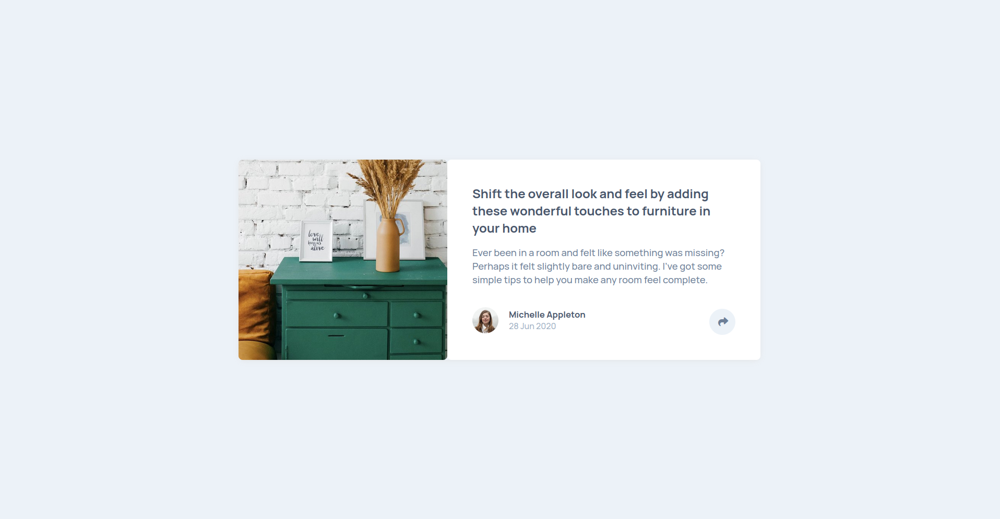

# Frontend Mentor - Article preview component solution

This is a solution to the [Article preview component challenge on Frontend Mentor](https://www.frontendmentor.io/challenges/article-preview-component-dYBN_pYFT). Frontend Mentor challenges help you improve your coding skills by building realistic projects. 

## Table of contents

- [Overview](#overview)
  - [The challenge](#the-challenge)
  - [Screenshot](#screenshot)
  - [Links](#links)
- [My process](#my-process)
  - [Built with](#built-with)
  - [Continued development](#continued-development)
- [Author](#author)

## Overview
    This was a rather easy project, I just needed time to adjust fonts and the paddings on both screens. For the button I added a event listener which would change the classlists of the popup and the button changing their properties accordingly.
### The challenge

Users should be able to:

- View the optimal layout for the component depending on their device's screen size
- See the social media share links when they click the share icon

### Screenshot

### Links

- Solution URL: [https://anas-sdeprj-article-preview.com](https://anas-sdeprj-article-preview.com)
- Live Site URL: [Add live site URL here](https://your-live-site-url.com)

## My process

    I started off with the mobile version of the website and created a container placing two more containers within them. One stored the image used for the showcase and the second contained the content. I gave the content the necessary tags. I positioned the share button relative to the container and gave its position in accordance to the padding of the container. I created the popup and also gave it a relative position to the content at the bottom and gave it a width that covered the entire width of the container i adjusted the z index of the share button so that it showed even when the popup was showing i adjusted the color of the background of the svg and used two svgs for the active and inactive states. For the name of the author of the blog post i adjusted positioned the name and date in a column and adjusted the font weights of both as well as sizes. For the desktop version i just gave the container two columns and then gave tsizes of 40% and 60% which automatically adjusted the heights. I readjusted posiiton of the share button and author div. After readjsuting the sizes of of the font i adjsuted the width of the popup and the position from the bottom and created the pointer. To make the button functional I added an eventlistener to the button and the popup which would toggle the active class to both divs this would change the color of the button and show the popup. 

### Built with

- Semantic HTML5 markup
- CSS custom properties
- Flexbox
- CSS Grid
- Mobile-first workflow

### Continued development

I didn't like the way I styled the pointer to the popup. In this project I used a div placed within another div to create this pointer. I positioned the second div relative to the first div and rotated the first div to give it the pointer look. I then placed half of the div behind the popup by adjusting their z-indices. I did see a method where people used an :after pseudo element and adjusted the borders to achieve the same look.

## Author

- Frontend Mentor - [@AnasIsmai1](https://www.frontendmentor.io/profile/AnasIsmai1)
- Instagram - [@a_ismail.ai](https://www.instagram.com/a_ismail.ai)
