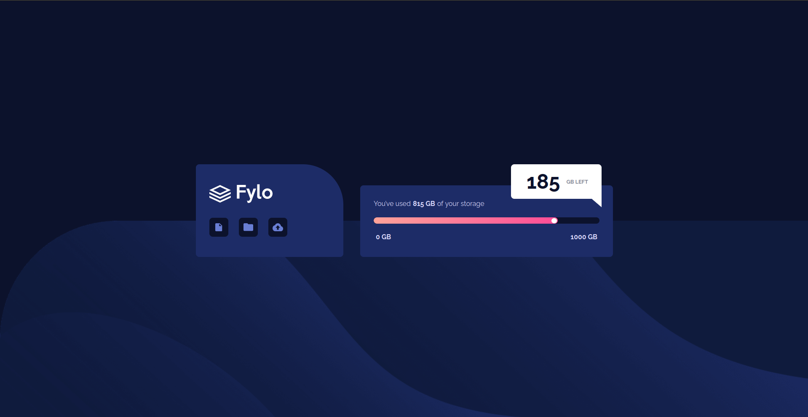

# Frontend Mentor - Fylo data storage component solution

This is a solution to the [Fylo data storage component challenge on Frontend Mentor](https://www.frontendmentor.io/challenges/fylo-data-storage-component-1dZPRbV5n). Frontend Mentor challenges help you improve your coding skills by building realistic projects. 

## Table of contents

- [Overview](#overview)
  - [The challenge](#the-challenge)
  - [Screenshot](#screenshot)
  - [Links](#links)
- [My process](#my-process)
  - [Built with](#built-with)
  - [Continued development](#continued-development)
- [Author](#author)

## Overview

### The challenge

Users should be able to:

- View the optimal layout for the site depending on their device's screen size

### Screenshot

### Links

- Solution URL: [https://github.com/AnasIsmai1/Frontend-Mentor-Projects](https://github.com/AnasIsmai1/Frontend-Mentor-Projects)
- Live Site URL: [https://anas-sdeprj-fylo-data-storage.netlify.app/](https://anas-sdeprj-fylo-data-storage.netlify.app/)

## My process

I first started off with the mobile first version of the website which just involved setting the right background image and then creating two cards within the container. After that i gave the proper tags to all the content within both the cards. In the first card i set the border radius, the height, the width and the color of the card. I then adjusted the sizes of the logo and the icons of the images in the first card. i followed this with adjusting the font weights and sizes in the second card adding span tags to specific elements with greater size and weight within a sentence. I then created a progress bar, the process of which just included the creation of the bg of the bar the bar itself and adding the gradient colour the bar. At the end i added a white ball to the bar. I crated a popup for the amount of storage left. As i added a media query i adjusted the flex direction and then added the pointer to the popup.

### Built with

- Semantic HTML5 markup
- CSS custom properties
- Flexbox
- CSS Grid
- Mobile-first workflow
- [React](https://reactjs.org/) - JS library
- [Next.js](https://nextjs.org/) - React framework
- [Styled Components](https://styled-components.com/) - For styles

### Continued development

I would like to improve the size aspect ratio and the background image for the mobile cersion of the website. I had a hard time choosing wether to set the background as an img tag or as the background-image to the body. 

## Author

- Frontend Mentor - [@AnasIsmai1](https://www.frontendmentor.io/profile/AnasIsmai1)
- Instagram - [@a_ismail.ai](https://www.instagram.com/a_ismail.ai)

