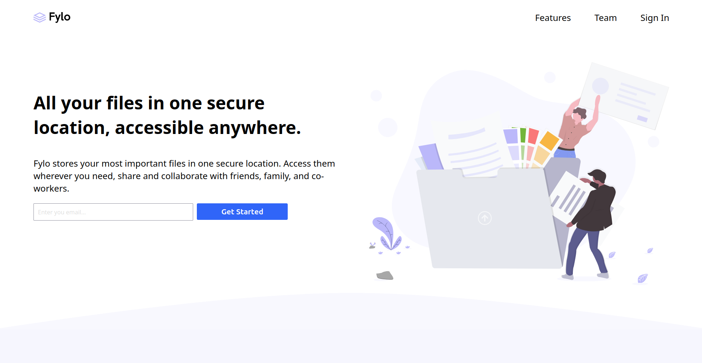

# Frontend Mentor - Fylo landing page with two column layout solution

This is a solution to the [Fylo landing page with two column layout challenge on Frontend Mentor](https://www.frontendmentor.io/challenges/fylo-landing-page-with-two-column-layout-5ca5ef041e82137ec91a50f5). Frontend Mentor challenges help you improve your coding skills by building realistic projects. 

## Table of contents

- [The challenge](#the-challenge)
  - [Screenshot](#screenshot)
  - [Links](#links)
- [My process](#my-process)
  - [Built with](#built-with)
  - [Continued development](#continued-development)
  - [Useful resources](#useful-resources)
- [Author](#author)

### The challenge

Users should be able to:

- View the optimal layout for the site depending on their device's screen size
- See hover states for all interactive elements on the page

### Screenshot

### Links

- Live Site URL: [https://anas-sdeprj-fylo-landing-page.netlify.app/](https://anas-sdeprj-fylo-landing-page.netlify.app/)

## My process
I started out with the mobile version of the website. I divided the website into five sections namely the header, the first section, the section, the newsletter, the footer.
I started out with the header which just involved creating a navbar and adding the logo and using flex to add space between them. In the first section I added a picture and the necessary components such as headings, paragraphs and a form with an email input and a button. I gave the container a percentage width to give it some responsiveness. In the second I added a picture along with similar components from the first section with the addition of a quote card component and a link which leads to another page. I then moved over to the newsletter portion which plainly simple was just a smaller version of the first section. In the footer i added the logo along with the necessary images for some info within the footer i used the flexbox to justify to the right and gave them gaps for some presentation. After that I moved on to the desktop version of the website in which I arranged the container in grid layout with 50% layout for both  the picture and the content itself. After doing this for both container I did the same for the newsletter I then added the hover animations for the buttons and a tags. At the end i finished the project after adjusting the layout of the footer.
### Built with

- Semantic HTML5 markup
- CSS custom properties
- Flexbox
- CSS Grid
- Mobile-first workflow
- [Styled Components](https://styled-components.com/) - For styles

### Continued development

If able to i would like to add a tablet version to this website. I am looking into how to make a website efficient for screen readers although i didn't add any of those findings into this website but i will do so in the future.

## Author

- Frontend Mentor - [@AnasIsmai1](https://www.frontendmentor.io/profile/AnasIsmai1)
- instagram - [@a_ismail.ai](https://www.instagram.com/a_ismail.ai)

