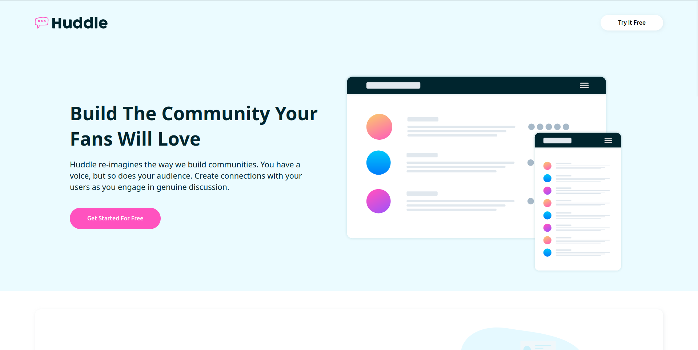

# Frontend Mentor - Huddle landing page with alternating feature blocks solution

This is a solution to the [Huddle landing page with alternating feature blocks challenge on Frontend Mentor](https://www.frontendmentor.io/challenges/huddle-landing-page-with-alternating-feature-blocks-5ca5f5981e82137ec91a5100). Frontend Mentor challenges help you improve your coding skills by building realistic projects. 

## Table of contents

- [Overview](#overview)
  - [The challenge](#the-challenge)
  - [Screenshot](#screenshot)
  - [Links](#links)
- [My process](#my-process)
  - [Built with](#built-with)
  - [Continued development](#continued-development)
- [Author](#author)

## Overview 

The project wasn't that hard at all just involved using flexbox and adjusting its direction based on its screen size for the best layout.

### The challenge

Users should be able to:

- View the optimal layout for the site depending on their device's screen size
- See hover states for all interactive elements on the page

### Screenshot

### Links

- Solution URL: [https://github.com/AnasIsmai1/Frontend-Mentor-Projects/tree/main/huddle-landing-page-with-alternating-feature-blocks-master](https://github.com/AnasIsmai1/Frontend-Mentor-Projects/tree/main/huddle-landing-page-with-alternating-feature-blocks-master)
- Live Site URL: [https://anas-sdeprj-huddle-landing-page.netlify.app/](https://anas-sdeprj-huddle-landing-page.netlify.app/)

## My process

I started with the mobile version of the website and within it I began with the header. I set the necessary variables and styles from the style guide and then began with setting the background color for the header and the main section by wrapping them within a single container which contained their background image which I set through the css rather than the html. I then gave that image a background-color. After setting the image size for the logo i set a general mixin for the button sizings and applied it to all the buttons in the file. After that i genrally styled the main and section with gird displays so that i could easily adjust the layout for both mobile and desktop. I styled the article by giving it a position within the footer. I gave the footer a color and set the pos of the by placing it out of the container as well as setting the copywright and setting it in their appropriate positions by setting the display of the footer. i created 3 stacks and one social div. With the second and third sections i placed the content within a listing removed their list style type and paddings altogether and aligned to them the left. I then adjusted the content within the container with the help of flexbox and jsutified the content by giving them space in between. 

### Built with

- Semantic HTML5 markup
- CSS custom properties
- Flexbox
- CSS Grid
- Mobile-first workflow
- [Font Awesome](https://fontawesome.com/) - For icons

### Continued development

Use this section to outline areas that you want to continue focusing on in future projects. These could be concepts you're still not completely comfortable with or techniques you found useful that you want to refine and perfect.

## Author

- Frontend Mentor - [@AnasIsmai1](https://www.frontendmentor.io/profile/AnasIsmai1)
- Twitter - [@a_ismail.ai](https://www.instagram.com/a_ismail.ai)

