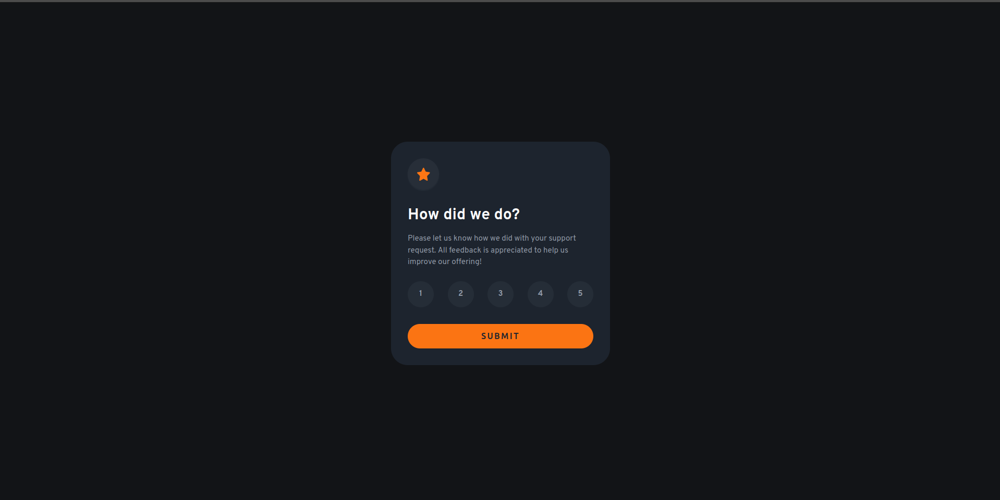

# Frontend Mentor - Interactive rating component solution

This is a solution to the [Interactive rating component challenge on Frontend Mentor](https://www.frontendmentor.io/challenges/interactive-rating-component-koxpeBUmI). Frontend Mentor challenges help you improve your coding skills by building realistic projects. 

## Table of contents

- [Overview](#overview)
  - [The challenge](#the-challenge)
  - [Screenshot](#screenshot)
  - [Links](#links)
- [My process](#my-process)
  - [Built with](#built-with)
  - [Continued development](#continued-development)
- [Author](#author)

## Overview
    The project mostly just involved handling user input via buttons and the submit button. I applied a few error handling scenarios as well a few tests within the console as well.
### The challenge

Users should be able to:

- View the optimal layout for the app depending on their device's screen size
- See hover states for all interactive elements on the page
- Select and submit a number rating
- See the "Thank you" card state after submitting a rating

### Screenshot

### Links

- Live Site URL: [https://anas-sdeprj-interactive-rating.netlify.app/](https://anas-sdeprj-interactive-rating.netlify.app/)

## My process
    I started with the first card by styling the different components and giving them the different paddings and sizes. After that I styled the thank you card. I gave the buttons ids and values as attributes so when i click a button i will receive the value stored within the button. I will then give the value to the a span element within the ratings in the thank you card. I created a variable which will store a nodelist of all the buttons including the submit button. I will then check if the button has the value attribute, if it did i will add "active" to their classlists Whenever i would select a button i would take the value from the button and give it to the ratings span as well as check if any button was previously selected if it did i would then remove their active class. After that i gave both cards active classes. Where the first card was visible in its non-active state while the second wasn't consequently the second card was visible while the first card wasn't in their active states. I triggered this via the submit button which added active classes to them on submission. I would check if any button is selected in submission if it wasnt i send a popup message.
### Built with

- Semantic HTML5 markup
- CSS custom properties
- Flexbox
- CSS Grid
- Desktop-first workflow

### Continued development

I havent given much consideration to the mobile version of this webiste at the moment, but will return to fix up the dimensions and the font sizings to this project.

## Author

- Frontend Mentor - [@AnasIsmai1](https://www.frontendmentor.io/profile/AnasIsmai1)
- Instagram - [@a_ismail.ai](https://www.instagram.com/a_ismail.ai)

